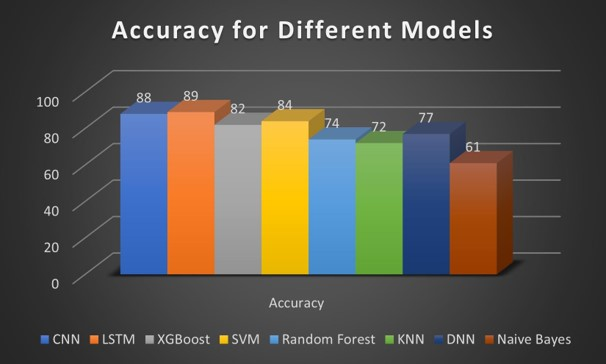

# Music-Genre-Classification

Music genre classification aims to classify the music files in certain genre it belongs to. Automatic categorization of music into different genres is done using Machine learning/Deep learning tools. 

Used the GTZAN dataset, which contains 1000 audio files of 10 different genres. This contains ten genres: Blues, Classical, Country, Disco, Hip-Hop, Jazz, Pop, Metal, Reggae, and Rock. There are 100 music clips of each genre. Each clip is 30 seconds long, with sample rate of 22050Hz.

1) Features: 
Extracted timbral texture features includes Spectral entroid, Spectral flux, Root Mean Square Energy (RMSE), Zero-crossing rate (zcr), Spectral contrast, Spectral bandwidth, Spectral flatness, Spectral roll-off and Mel-Frequency Cepstral Coefficients (MFCC). Chroma features used are chroma, tonnetz, also used tempo as a rhythmic content feature and pitch as a pitch content feature. Used 20 MFCCCs. Used 1024 fft/window length and512 hop length for Short-time Fourier transform(STFT). For each feature (except tempo) we have taken 6 statistics such as maximum, minimum, mean, standard deviation, kurtosis, and skewness. Hence total number of features for each sample becomes 31 (20 MFCCs + 11 other features) * 6(statistics) + 1(tempo) = 187 

2) Classification: For CNN & LSTM, divided each audio file into 10 segments (3 sec each) and then getting mel-spectogram
(using 20 MFCCs) of each segment, to use in model. Performed classification using these models -> XGBoost, Random Forrest, K Nearest Neighbour (KNN), Support Vector Machine (SVM), Na¨ıve Bayes, Deep Neural Network (DNN), Convolutional Neural Network (CNN) and Long Short Term Memory (LSTM). 

3) Results: 

   

